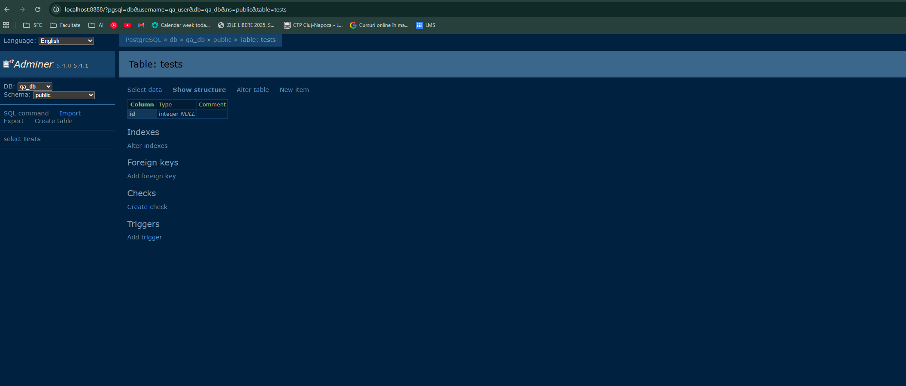

# REZOLVARE - QA Docker Compose Lab

##Screenshot din Adminer

Tabelul `tests` a fost creat cu succes în baza de date `qa_db` folosind interfața Adminer

---

## Explicație despre flag-ul `-v`

Flag-ul `-v` din comanda `docker compose down -v` este esential, deoarece șterge și volumele asociate containerelor.  
